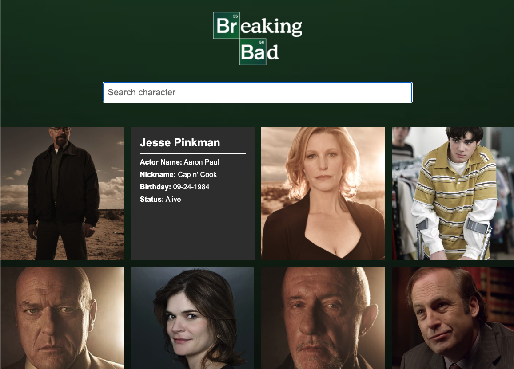
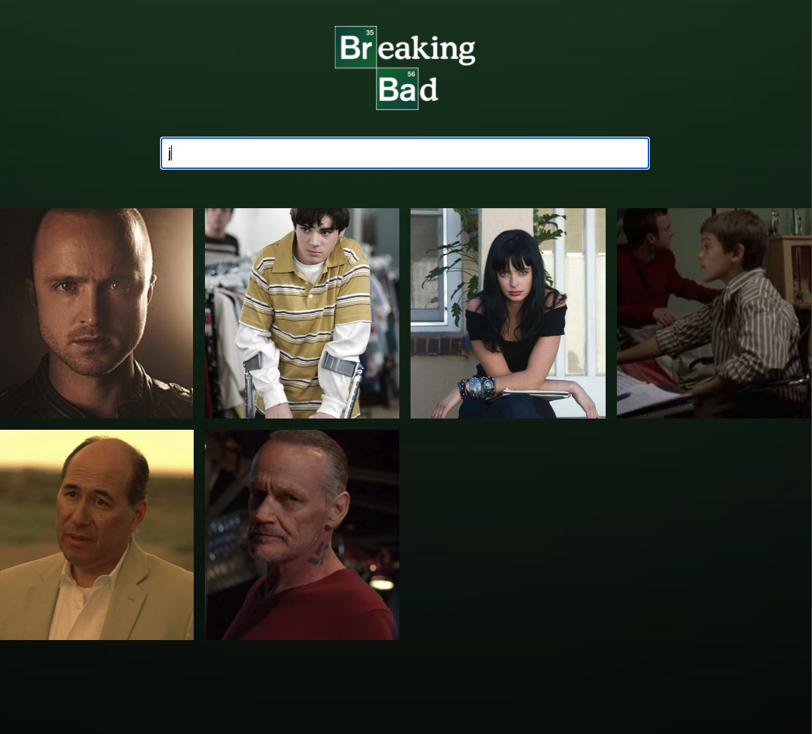

# A React application with data from the Breaking Bad API

This application has been built with React using data from the Breaking Bad API. The list of characters is loaded when entering the page. On hover the card flips showing character information.
The result can be narrowed down by typing in the search box.

## API used

The Breaking Bad API can be found @ [https://breakingbadapi.com/documentation](https://breakingbadapi.com/documentation)
 
 

## Using create-react-app

The project was initialized with create-react-app, [Create React App](https://github.com/facebook/create-react-app)

## Installed dependencies

Axios, for making API-requests, has been added as a dependency to the project. [axios](https://www.npmjs.com/package/axios) 
  

# Instructions to run the application

Run these commands in the project directory: 
Installing dependencies 
`$ npm install`

Starting the application in development mode 
`$ npm start`

This should open the application in the browser, otherwise go to: 
[http://localhost:3000](http://localhost:3000) 
The page will reload if you make code edits.

# Screenshots

Character listing

Character info on hover

Using filtering

## Author

- Albert Stjärne (https://github.com/AlbertStjarne)
